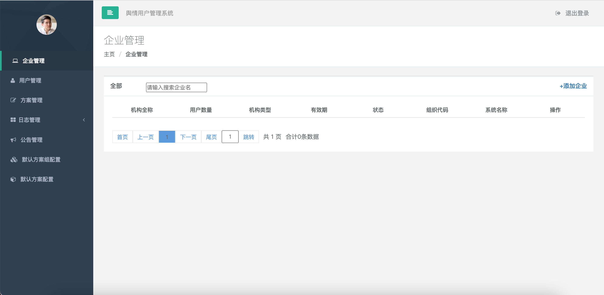

# 开源舆情监测监控系统后台

### 介绍
开源免费舆情监测网络监控系统的后台管理系统，**开源舆情系统请访问：**  https://gitee.com/stonedtx/yuqing

### 软件架构
软件架构说明，管理子系统分为4个主要部分：

- 1.企业管理
  
  可以创建一个企业或组织，在这个组织下可以创建多个舆情用户。

- 2.用户管理

  在组织管理基础上可创建多个用户，每个用户可创建不同的方案，以及对多个不同用户的状态和密码管理。

- 3.方案管理

  管理员可以对用户配置的方案进行管理，以及查看方案配置详情。

- 4.日志管理
 
  管理员可以查看用户的登录次数以及用户具体操作了哪些功能菜单。

### UI 展示

- 组织管理

- 用户管理

- 方案管理

- 日志管理

### 安装教程 (待续未完)

1.  下载发行版,下载 [yq-basic-admin.jar](https://gitee.com/stonedtx/yuqing-manager/blob/master/lastest_version/yq-basic-admin.jar) 程序，与 config文件夹 在同目录下。
2.  下载 [application.yml](https://gitee.com/stonedtx/yuqing-manager/blob/master/config/application.yml)，并创建 **config目录**  与 stonedt-yuqing.jar 在同一个目录下，可修改配置文件参数。
3.  安装MySQL、redis，执行建表 [initialize_db_cache.sh](https://gitee.com/stonedtx/yuqing-manager/blob/master/initialize_db_cache.sh)  脚本。
4.  执行 java -jar yq-basic-admin.jar运行启动

### 使用说明

1.  本地浏览器输入 http://127.0.0.1:8124
2.  输入默认用户名：13900000000 ，密码：stonedt

##  按需定制|数据定制
  当您在开发与研究中遇到  **数据采集、数据处理、舆情系统定制**  等方面的问题，请联系我们，我们会以最快的速度提供专业的解决方案。为您提供必要的专业技术支持。

  服务流程如下

## 相关开源项目

- **[数据采集系统](https://gitee.com/stonedtx/yuqing-manager)** 

    采用分布式技术对海量信息采集，采集类型包括文字、图象、音频、视频等。

- **[数据处理系统](https://gitee.com/stonedtx/yuqing-process)** 
 
  将采集数据采用NLP和文本挖掘技术对此标签，以便于用户分类查看和检索。

- **[监测分析系统](https://gitee.com/stonedtx/yuqing-manager)** 
   
  对采集数据展示分析，提供用户个性化配置，让每个用户获取不同的数据分析展示结果。

- **[后台管理系统](https://gitee.com/stonedtx/yuqing-manager)** 
   
   对组织和用户、方案配置、用户日志 等，提供了一套管理后台。

## 产品经理微信
   扫描微信二维码，技术交流。

## 捐赠方式

## 联系我们

+ 微信号： techflag  

+ 电话： 13505146123

+ 邮箱： wangtao@stonedt.com

+ 公司官网：[www.stonedt.com](http://www.stonedt.com)

欢迎您在下方留言，或添加微信与我们交流。

## License & Copyright

Copyright (c) 2014-2022 思通数科 StoneDT, All rights reserved.

Licensed under The GNU General Public License version 3 (GPLv3)  (the "License"); you may not use this file except in compliance with the License. You may obtain a copy of the License at

<https://www.gnu.org/licenses/gpl-3.0.html>

Unless required by applicable law or agreed to in writing, software distributed under the License is distributed on an "AS IS" BASIS, WITHOUT WARRANTIES OR CONDITIONS OF ANY KIND, either express or implied. See the License for the specific language governing permissions and limitations under the License.